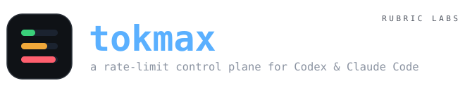
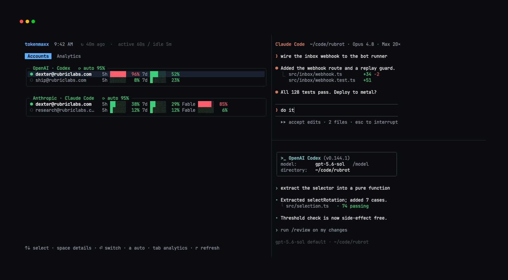
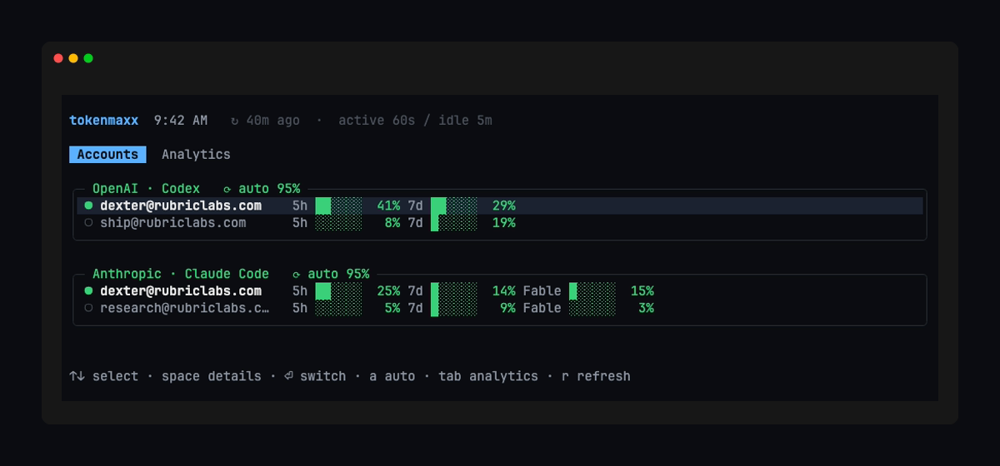
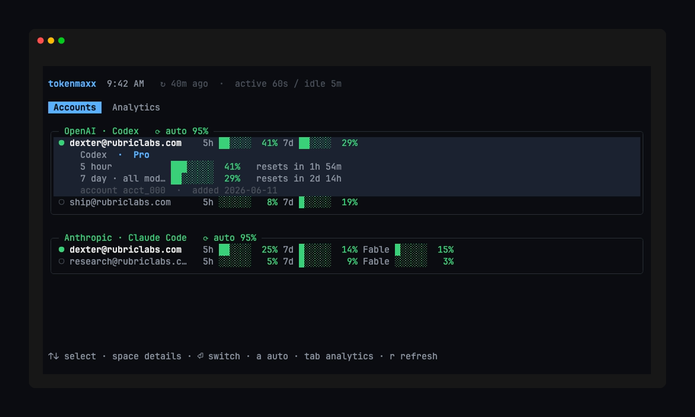
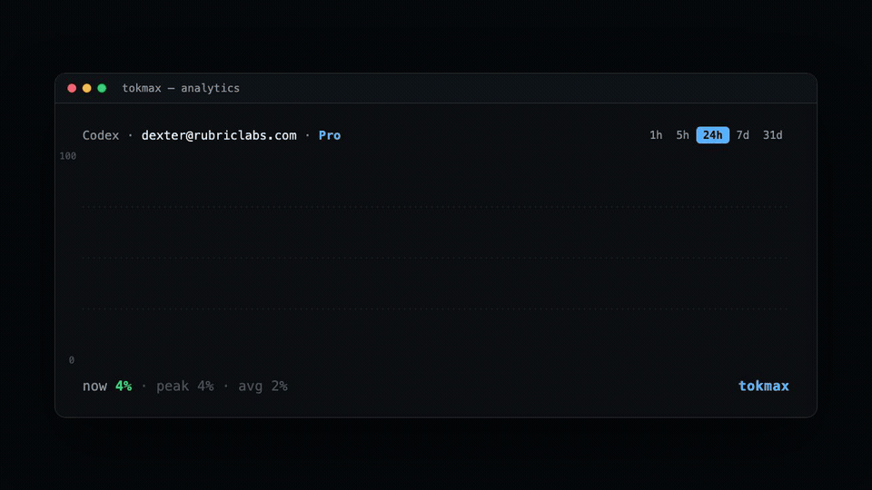
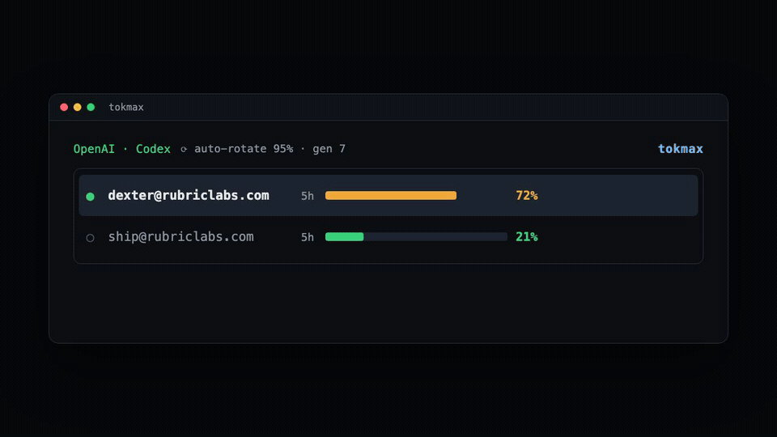

<div align="center">

<picture>
  <source media="(prefers-color-scheme: dark)" srcset="assets/brand/logo-dark.svg">
  <source media="(prefers-color-scheme: light)" srcset="assets/brand/logo-light.svg">
  
</picture>

<br/>
<br/>

**Juggle rate limits across all your Codex and Claude Code accounts — and see every token you burn.**
One loopback proxy injects the right account per request (switching takes effect on the
very next request, even mid-turn) and meters the tokens streaming through it.

<sub>macOS · [Bun](https://bun.sh) 1.2+ · MIT · a [Rubric Labs](https://rubriclabs.com) project</sub>

<br/>

<picture>
  <source media="(prefers-color-scheme: dark)" srcset="assets/generated/flagship-dark.png">
  <source media="(prefers-color-scheme: light)" srcset="assets/generated/flagship-light.png">
  
</picture>

</div>

## Install

```bash
bun add -g tokenmaxx      # or run once with: bunx tokenmaxx
```

That's it — you get the `tokenmaxx` command. Then:

```bash
tokenmaxx login codex        # sign in (isolated login home; existing sessions untouched)
tokenmaxx login claude
tokenmaxx install            # route native codex & claude through tokenmaxx (restorable)

codex                        # use the clients exactly as before — tokenmaxx injects the account
claude
```

`tokenmaxx doctor` verifies the local tools and the manager boundary.

## What it is

You have more than one ChatGPT/Codex and Claude subscription, and you keep hitting the
five-hour or weekly limit on whichever one you're using. tokenmaxx watches every account's
usage and moves your traffic to whichever account still has headroom.

It manages two independent axes:

- **Provider accounts** — your OpenAI and Anthropic subscriptions.
- **Runtime clients** — the Codex CLI and Claude Code.

After `tokenmaxx install`, plain `codex` and `claude` route through a loopback proxy on
`127.0.0.1:8459`. The proxy reads the **active account per request** and injects that
account's credential, so a switch is just a local state update the next request picks up —
no drain, no restart. Credentials live in the macOS Keychain; SQLite holds only identities,
health, usage, and opaque references — never tokens.

## The dashboard

`tokenmaxx` opens a live dashboard. **Accounts** shows every account and its rate-limit
windows, colored by pressure — green with headroom, amber getting full, red near the limit.

<picture>
  <source media="(prefers-color-scheme: dark)" srcset="assets/generated/accounts-dark.png">
  <source media="(prefers-color-scheme: light)" srcset="assets/generated/accounts-light.png">
  
</picture>

Press **space** to expand an account — plan tier, every window's reset countdown, and its
identity — without leaving the list.

<picture>
  <source media="(prefers-color-scheme: dark)" srcset="assets/generated/expanded-dark.png">
  <source media="(prefers-color-scheme: light)" srcset="assets/generated/expanded-light.png">
  
</picture>

Navigation is simple: **Tab** switches between Accounts and Analytics, the **arrows** move
within the current tab, **enter** switches to the focused account.

## Analytics — token throughput

The **Analytics** tab is a live view of your token throughput: tokens per unit time,
**combined across every account and both providers**, scaled to the peak so it reads like an
activity monitor — flat when idle, spiking when you're working. It also shows the totals that
matter: total tokens over the window, peak tokens/hour, the busiest model, and the **≈ API
value** — what those tokens would cost at public API list prices, i.e. how much you're
extracting from your flat subscriptions.

<div align="center">
<picture>
  <source media="(prefers-color-scheme: dark)" srcset="assets/generated/timelapse-dark.gif">
  <source media="(prefers-color-scheme: light)" srcset="assets/generated/timelapse-light.gif">
  
</picture>
</div>

The tokens are measured by the proxy as responses stream by — it never buffers or delays a
response, and the chart fills in from the moment you install.

## Automatic rotation

Turn on auto-rotation and tokenmaxx moves off an account the moment its fullest hard window
crosses your threshold, onto the eligible account with the most headroom — mid-turn, on the
next request.

<div align="center">
<picture>
  <source media="(prefers-color-scheme: dark)" srcset="assets/generated/switch-dark.gif">
  <source media="(prefers-color-scheme: light)" srcset="assets/generated/switch-light.gif">
  
</picture>
</div>

```bash
tokenmaxx auto codex on --threshold 95
tokenmaxx auto claude on --threshold 95
tokenmaxx auto both on --threshold 95     # or: off
```

The selector is a pure, deterministic function. It triggers when the active account reaches
the threshold in **any** hard window; refuses stale, missing, rate-limited, disabled, or
unhealthy candidates; ranks the rest by their worst hard-window pressure, lowest first; and
applies hysteresis and a minimum dwell (holds an account ≥ 5 min) to prevent oscillation. A
failed or expired reading is `unknown`, never `0%`.

Automatic rotation is **off by default** — enabling it from the CLI is your confirmation that
your provider permits this use of the accounts (see [Provider authorization](#provider-authorization)).

## Commands

| Command | What it does |
|---|---|
| `tokenmaxx` | Live dashboard (text render when piped) |
| `tokenmaxx login <codex\|claude>` | Sign in to a provider; idempotent, re-auths in place |
| `tokenmaxx install` · `uninstall` | Route native clients through the proxy · restore config |
| `tokenmaxx list` | Accounts, health, and the active marker |
| `tokenmaxx switch <codex\|claude> <email-or-id>` | Make an account active (~2s) |
| `tokenmaxx auto <codex\|claude\|both> <on\|off> [--threshold N]` | Configure auto-rotation (default 95) |
| `tokenmaxx status` · `refresh` | Machine-readable snapshot · re-probe usage now |
| `tokenmaxx doctor` | Check tools, proxy, config, and legacy state |
| `tokenmaxx daemon <start\|stop\|status>` | Manage the local daemon (usually automatic) |

`codex`/`openai` and `claude`/`anthropic` are interchangeable.

## How it works

`tokenmaxx switch` probes the target credential to confirm it's usable, then commits the new
active account to SQLite. Because the proxy reads the active account per request, the change
applies on the **very next request** — including one mid-turn. On a `401` the proxy performs
one reactive refresh and replays the request, so a token that expires between probes never
surfaces to the client.

`tokenmaxx install` writes restorable managed blocks into your client config: a `tokenmaxx`
model provider in `~/.codex/config.toml` (pointing at the proxy, `wire_api = "responses"`),
and `ANTHROPIC_BASE_URL` + a placeholder `ANTHROPIC_AUTH_TOKEN` in `~/.claude/settings.json`
(the real OAuth token is injected server-side). `tokenmaxx uninstall` restores both exactly —
and still recognizes blocks written by older versions.

## Configuration

| Variable | Purpose |
|---|---|
| `TOKENMAXX_HOME` | Relocate/isolate state (default `~/.codex-auth`) |
| `TOKENMAXX_PROXY_PORT` | Override the proxy port (default `8459`, loopback only) |
| `TOKENMAXX_THEME` | Force `light` or `dark` (else auto-detected) |

State lives under `~/.codex-auth` by default — the path is kept deliberately, because Claude
Keychain items are keyed to it.

## Provider authorization

This is a local orchestration tool, not a way to obtain additional entitlement. Use only
accounts you own or administer, and only where the relevant agreement permits account
automation. Anthropic currently says Claude.ai OAuth is intended for Anthropic applications
and restricts third parties from routing subscription credentials without approval.
([Claude Code legal & compliance](https://code.claude.com/docs/en/legal-and-compliance) ·
[Anthropic Consumer Terms](https://www.anthropic.com/legal/consumer-terms))

For that reason the project ships monitoring and manual switching normally, and automatic
rotation is off by default. Enabling it records your confirmation; it is not legal advice or
provider approval.

## Development

```bash
bun install
bun run check     # typecheck + lint
bun run build     # bundle to dist/
bun run assets    # regenerate every screenshot + the flagship (see assets/README.md)
```

TypeScript + Zod 4, Bun SQLite, and Biome. No CLI framework and no hidden global state:
schemas own boundaries, SQLite owns durable transitions, provider adapters own unstable
integration details, the selection engine is a pure function, and the proxy stays a pure
pass-through. Every image in this README is generated from source — the real TUI rendered
against synthetic fixtures with a pinned clock — so it regenerates deterministically
(`assets/`, `remotion/`).

## License

MIT — © Rubric Labs. Built by [Rubric Labs](https://rubriclabs.com).
